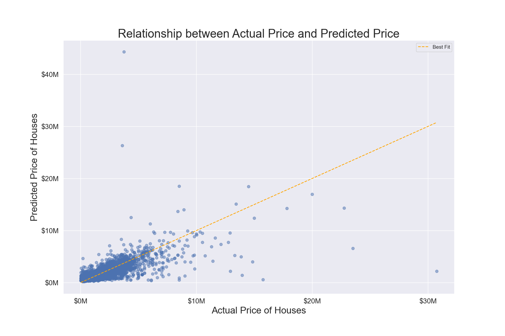
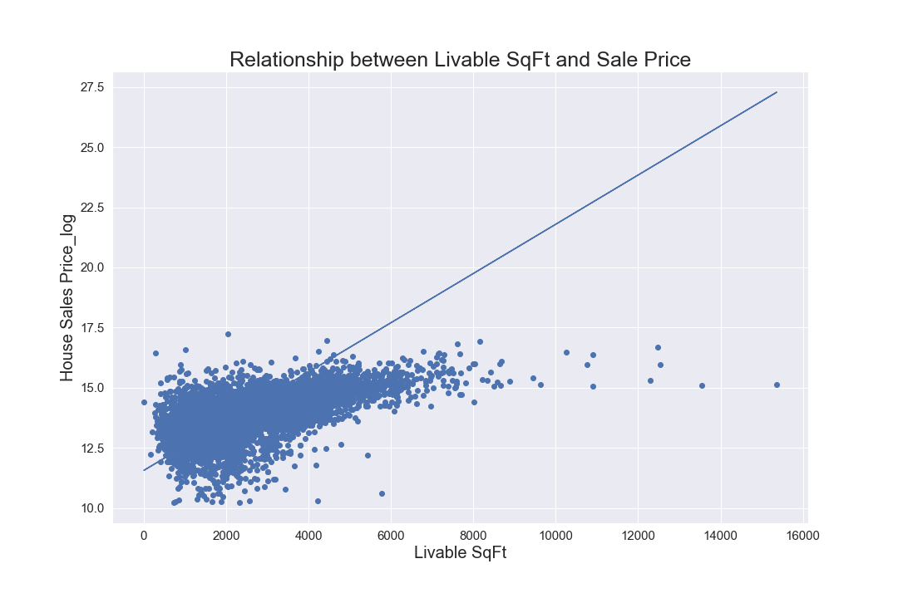
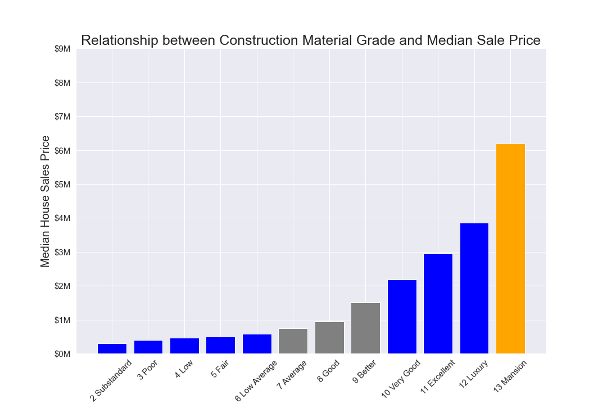
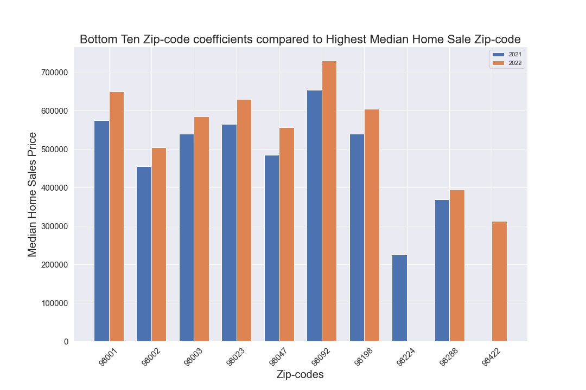

# King County, Washington Housing Sales Analysis and Recommendations

**Authors**: [Alison Park](mailto:alisonsjpark@gmail.com), [Vlad Sekiguchi](mailto:vladsekig@gmail.com)

## Overview

For this project, we use a multiple linear regression model to analyze house sales in King County, a large county located in the State of Washington. 

## Business Problem
How can we help identify price dislocation in Washington King County based on certain housing features. To examine pricing in the area we are analyzing recent sales data (2021 - 2022). Consultation services for Seattle Real Estate Investment Holdings, to identify investment grade houses and areas based on housing features effect on price.

## Data
This project uses the King County House Sales dataset, which can be found in kc_house_data.csv in the data folder of this project's GitHub repository. The description of the column names can be found in column_names.md in the same folder.

## Methods
We cleaned the data to only include house sales in the state of Washington. To analyze the data we used simple linear regressions as well as multiple linear regressions to see the relationship between housing features and their sale price. After iterating and examining which features we thought increased the R^2 the mmost, we crafted our final regression to help infer pricing.

## Results
We examined eight housing features:

    - Livable Square Feet
    - Bedrooms
    - Bathrooms
    - View (which is a categorical variable, and adds an additional five features)
    - Grade (which is a categorical variable, and adds an additional 13 features)
    - Zip-code(which is a categorical variable, and adds an additional 92 features)
    - Year House was Sold

Our model produces an R^2 of 0.691. This explains around 69.1% of the variance in house sales price. Below is a graph depicting the predicted house sales price vs the actual house sales price. For additional steps to refining the model, we believe that removing certain outliers would help.



### 1. Relationship between Livable Square Feet and Home Sales Price
One unit increase in livable sqft on average produces a price increase of 0.02%.



### 2. Relationship between Construction Material Grade and Median Home Sales Price
Shows the statistically significant (in blue) Construction Material Grade. The reference is in orange, and the NOT statistically significant.


### 3. Bottom 10 Zip-code coefficients compared to the most Expensive Median Home Sale Zip-code
The Zip-codes that have the largest discrepancy in median home sale price from the most expensive median home sale price Zip-code. This shows that even the comparably cheapest Zip-codes in Washington are appreciating in value.


## Recommendations

In conclusion we recommend that Seattle Real Estate Investment Holdings look for homes that:
- Fall within the median of livable square feet, which is in between 1,900 sf and 2,100 sf
- Acceptable Construction Grade Materials: Substandard, Poor, Low, Fair, Low Average, Very Good, Excellent, Luxury, Mansion
    - We would recommend focusing on Very Good and above, as the median sale price tends to be quite high for those.
- Zip-codes to focus on would be: 98422, 98224, 98288, 98002, 98047, 98003, 98023, 98001, 98092, 98198
    -These are the ten Zip-codes that had the most negative coefficients in comparison to the most expensive median sale Zip-code. We want to recommend the homes that are in areas that have sold the cheapest in relation to the most expensive Zip-code. As seen in the graph above, a rising tide lifts all boats. It's better to find the least valued homes if the city as a whole will continue to appreciate.

## Next Steps
Deeper analysis and further investigation into how the price of a square foot varies by zip-code. Additional sampling of the past and information to get the data to the present. An additional factor that would be very interesting to see would be the interest rate. That way we can measure whether it has had a significant impact on housing sales since the start of the aggressive hiking cycle mid 2022.

## For More Information
See the full analysis in the [Jupyter Notebook](https://github.com/vladiseki/Housing_Prices_P2_Project/blob/main/Final_notebook.ipynb) or review this [presentation](insert link to the pdf)

For additional info, contact [Alison Park](mailto:alisonsjpark@gmail.com), [Vlad Sekiguchi](mailto:vladsekig@gmail.com) 


## Repository Structure

```
├── Individual Notebooks
│   ├── Ali_jn.ipynb
│   ├── VS_housing_prices_rough_jn.ipynb
│   
├── data
├── images
├── README.md
├── Phase 2 Housing Project - AP, VS.pdf.pdf
└── Final_notebook.ipynb
```
    


